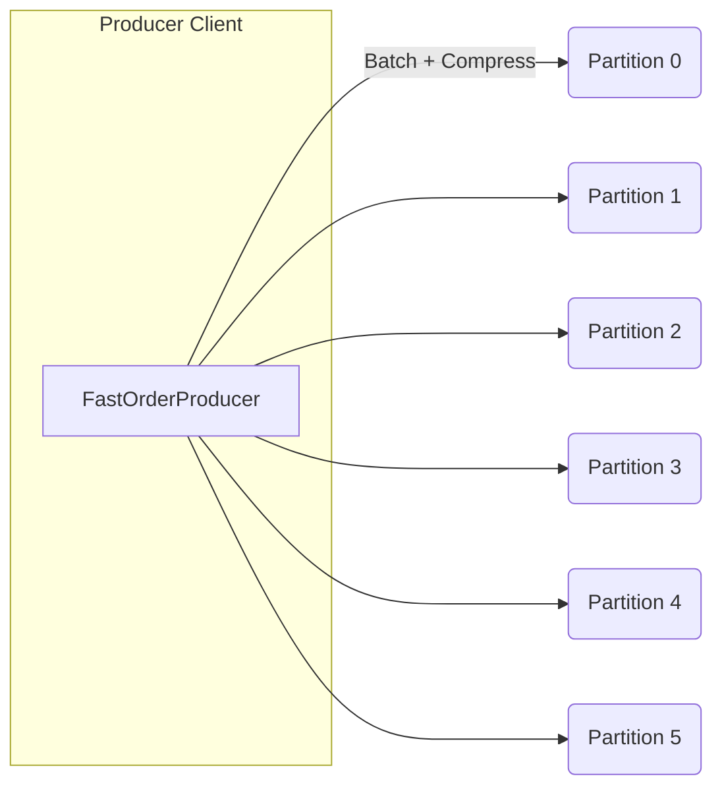
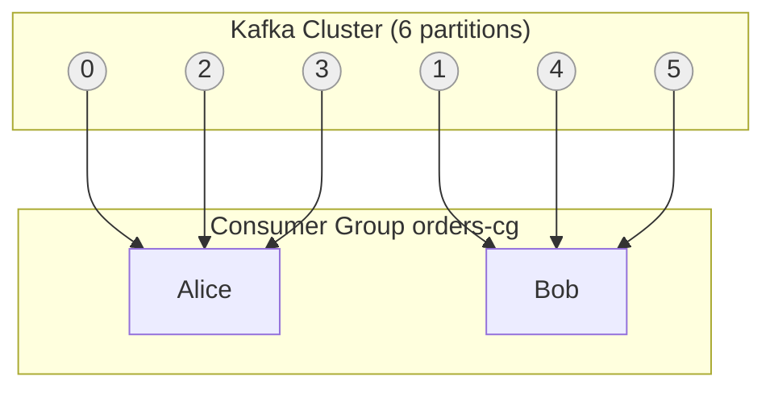

# 🧩 Chapter 3 – Multi-Partition Topics & Consumer Groups

## Goal

Learn how to scale Kafka read/write throughput with multiple partitions, observe how consumer groups split work, and practice producing data fast enough to see these effects.

## 🏗 1 – Create a Multi-Partition Topic

### Create the topic

```bash
docker exec -it kafka-1 bash
```

**Command explanation**: 
- `docker exec -it`: Execute a command in a running container
- `-it`: Interactive terminal (allows you to type commands)
- `kafka-1`: The container name
- `bash`: Start a bash shell inside the container

```bash
kafka-topics.sh \
  --create \
  --topic food.orders \
  --partitions 6 \
  --replication-factor 3 \
  --bootstrap-server kafka-1:9092,kafka-2:9092,kafka-3:9092
```

**Command explanation**:

**`kafka-topics.sh`**: Kafka's command-line tool for managing topics

**`--create`**: Create a new topic (fails if topic already exists)

**`--topic food.orders`**: The topic name. Use dots (`.`) to organize topics by domain/service (e.g., `food.orders`, `food.payments`, `user.events`)

**`--partitions 6`**: 
- **Partition** = a log file split into multiple pieces
- 6 partitions = 6 parallel "lanes" for messages
- More partitions = more parallelism (more consumers can read simultaneously)
- **Rule of thumb**: Start with partitions = number of consumers you'll have, can scale up later
- **Important**: You can only increase partitions, never decrease!

**`--replication-factor 3`**: 
- **Replication** = how many copies of each message to store
- 3 = each message stored on 3 different brokers
- If one broker crashes, data is still safe on the other 2
- **Rule of thumb**: replication-factor = 3 for production (1 for development)
- **Important**: replication-factor cannot exceed number of brokers!

**`--bootstrap-server kafka-1:9092,kafka-2:9092,kafka-3:9092`**: 
- List of Kafka brokers to connect to
- Only need to provide a few - Kafka discovers the rest automatically
- Format: `hostname:port`

**The backslash (`\`)** at the end of lines: Allows splitting a long command across multiple lines for readability

### Verify

```bash
kafka-topics.sh --describe --topic food.orders --bootstrap-server kafka-1:9092
```

**Command explanation**:
- `--describe`: Show detailed information about the topic
- `--topic food.orders`: Which topic to describe
- Shows partition distribution, leaders, replicas, ISR status

#### Example output

```
Topic: food.orders  PartitionCount: 6  ReplicationFactor: 3
  Partition: 0  Leader: 1  Replicas: 1,2,3  Isr: 1,2,3
  Partition: 1  Leader: 2  Replicas: 2,3,1  Isr: 2,3,1
  ...
```

### 📘 What this means

**`PartitionCount: 6`**: The topic has 6 partitions (as we specified)

**`ReplicationFactor: 3`**: Each partition has 3 replicas (copies)

**`Partition: 0  Leader: 1`**: 
- Partition 0's **Leader** is broker 1
- **Leader** = the broker that handles all reads and writes for this partition
- Producers send messages to the leader
- Consumers read from the leader

**`Replicas: 1,2,3`**: 
- This partition's data is stored on brokers 1, 2, and 3
- These are the 3 copies (replication-factor 3)

**`Isr: 1,2,3`**: 
- **ISR** = "In-Sync Replicas"
- These replicas are up-to-date with the leader
- If a replica falls behind (network issue, slow disk), it's removed from ISR
- For writes with `acks="all"`, Kafka waits for all ISR replicas to confirm

**Why different leaders?**: 
- Partition 0: Leader = broker 1
- Partition 1: Leader = broker 2
- This **distributes load** across brokers (no single broker is overloaded)
- Kafka automatically elects leaders and balances them

**Key Concepts**:
- **6 partitions** → 6 lanes of parallelism (6 consumers can read simultaneously)
- **Replication factor 3** → every message stored on 3 brokers (fault tolerance)
- **Leader** = broker handling writes for that partition (load distribution)
- **ISR** = "in-sync replicas" tracking that leader (consistency guarantee)

## ⚡ 2 – Fast Producer (producers/fast_order_producer.py)

A tuned producer that batches, compresses, and sends messages quickly.

### Code overview

```python
producer = KafkaProducer(
    bootstrap_servers=BOOTSTRAP.split(","),
    acks="all",              # Wait for leader + replicas
    linger_ms=20,            # Wait up to 20ms to batch
    batch_size=64*1024,      # 64 KiB buffer
    compression_type="lz4",  # Compress batches
    value_serializer=lambda v: json.dumps(v).encode("utf-8"),
    key_serializer=lambda k: k.encode("utf-8") if k else None,
)
```

### Code Explanation

**`bootstrap_servers=BOOTSTRAP.split(",")`**: 
- Takes a comma-separated string like `"localhost:9092,localhost:9094,localhost:9096"` and splits it into a list
- The producer connects to these brokers to discover the full cluster (brokers, topics, partitions)
- You only need to provide a few brokers - the producer discovers the rest automatically

**`acks="all"`**: 
- **acks** = "acknowledgments" - how many brokers must confirm receipt before the producer considers the message sent
- `"all"` means: wait for the leader AND all in-sync replicas (ISR) to confirm
- This is the safest mode - if the leader crashes, the message is still safe on replicas
- Trade-off: slower than `acks=1` (leader only) or `acks=0` (fire-and-forget), but more durable

**`linger_ms=20`**: 
- How long to wait (in milliseconds) before sending a batch
- If you send 10 messages quickly, instead of sending 10 separate requests, the producer waits up to 20ms to collect more messages into one batch
- **Why?** Sending one batch of 100 messages is much faster than 100 individual messages (less network overhead)
- Trade-off: adds 0-20ms latency per message, but dramatically increases throughput

**`batch_size=64*1024`**: 
- Maximum size (in bytes) of a batch before sending
- `64*1024` = 64 KiB (65,536 bytes)
- If a batch reaches this size, it's sent immediately (even if `linger_ms` hasn't elapsed)
- Larger batches = fewer network requests = higher throughput
- Trade-off: uses more memory per partition

**`compression_type="lz4"`**: 
- Compresses the batch before sending over the network
- **lz4** is fast compression (good balance of speed vs. size reduction)
- Alternatives: `"gzip"` (slower, better compression), `"snappy"` (faster, less compression), `"zstd"` (good balance)
- **Why?** Less network bandwidth = faster sends, especially for text/JSON data
- Kafka automatically decompresses on the broker side

**`value_serializer=lambda v: json.dumps(v).encode("utf-8")`**: 
- **Serializer** = converts Python objects to bytes (Kafka only stores bytes)
- This lambda function: takes a Python dict → converts to JSON string → encodes to UTF-8 bytes
- Example: `{"order_id": "123"}` → `'{"order_id": "123"}'` → `b'{"order_id": "123"}'`
- Without this, you'd have to manually convert every message

**`key_serializer=lambda k: k.encode("utf-8") if k else None`**: 
- Converts the message key (string) to bytes
- If key is `None`, returns `None` (no key)
- Keys are used for partitioning - messages with the same key go to the same partition

### Main Function Logic

```python
def main():
    n = int(os.getenv("COUNT", "50000"))
    use_keys = os.getenv("USE_KEYS", "false").lower() == "true"
    keys_space = [f"k{i}" for i in range(32)]
    
    t0 = time.time()
    futures = []
    
    for i in range(n):
        order = make_order(i)
        key = random.choice(keys_space) if use_keys else None
        futures.append(producer.send(TOPIC, key=key, value=order))
        
        if i % 5000 == 0 and i > 0:
            producer.flush()
    
    producer.flush()
    dt = time.time() - t0
    rate = n / dt if dt else n
    print(f"Sent {n} messages to {TOPIC} in {dt:.2f}s ({rate:,.0f} msg/s).")
```

**`producer.send(TOPIC, key=key, value=order)`**: 
- **Asynchronous** - doesn't wait for the message to be sent
- Returns a `Future` object (you can check if it succeeded later)
- The message is added to an internal buffer, and a background thread sends batches to Kafka
- This is why it's fast - you're not waiting for network I/O

**`producer.flush()`**: 
- Forces the producer to send all buffered messages immediately
- Blocks until all messages are sent and acknowledged
- Called every 5000 messages to prevent memory buildup during large runs
- Final flush ensures all messages are sent before timing ends

**Key vs. No Key**: 
- `key=None`: Kafka's default partitioner distributes messages across partitions (good for parallelism)
- `key="alice"`: All messages with key "alice" go to the same partition (preserves ordering per key)
- `keys_space`: 32 distinct keys spread across 6 partitions (32 keys ÷ 6 partitions ≈ 5-6 keys per partition)

### Run

```bash
COUNT=50000 python3 producers/fast_order_producer.py
```

#### Example output

```
Sent 50,000 messages to food.orders in 1.9s (25,590 msg/s).
```

### Data flow diagram



## 👥 3 – Consumer Group (consumers/group_order_consumer.py)

Each consumer in a group gets a subset of partitions.
Adding/removing consumers triggers a rebalance.

### Consumer Configuration

```python
consumer = KafkaConsumer(
    bootstrap_servers=[s.strip() for s in BOOTSTRAP.split(",") if s.strip()],
    group_id=GROUP,
    enable_auto_commit=True,
    auto_offset_reset=os.getenv("AUTO_OFFSET_RESET", "earliest"),
    value_deserializer=lambda b: json.loads(b.decode("utf-8")),
    key_deserializer=lambda b: b.decode("utf-8") if b else None,
    request_timeout_ms=40000,
    session_timeout_ms=30000,
    max_poll_records=500,
    fetch_max_bytes=50 * 1024 * 1024,
)
```

### Code Explanation

**`group_id=GROUP`**: 
- **Consumer Group** = a set of consumers that work together to consume a topic
- All consumers with the same `group_id` share the work - each partition is consumed by exactly one consumer in the group
- If you have 6 partitions and 2 consumers, each gets 3 partitions
- If you add a 3rd consumer, Kafka rebalances and each gets 2 partitions

**`enable_auto_commit=True`**: 
- Automatically commits offsets (position markers) after processing
- Kafka tracks "where you are" in each partition via offsets
- **Auto-commit** = commits periodically (default: every 5 seconds)
- Trade-off: if the consumer crashes, it might reprocess the last 5 seconds of messages (at-least-once semantics)

**`auto_offset_reset="earliest"`**: 
- What to do when there's no committed offset (first time, or offset was deleted)
- `"earliest"` = start from the beginning of the topic (read all historical messages)
- `"latest"` = start from the end (only new messages)
- `"none"` = throw an error if no offset exists

**`value_deserializer=lambda b: json.loads(b.decode("utf-8"))`**: 
- **Deserializer** = converts bytes (from Kafka) back to Python objects
- This lambda: takes bytes → decodes UTF-8 → parses JSON → returns Python dict
- Opposite of the producer's serializer

**`max_poll_records=500`**: 
- Maximum number of records to fetch in one `poll()` call
- Larger = fewer network requests, but more memory per poll
- 500 is a good default for most use cases

**`fetch_max_bytes=50 * 1024 * 1024`**: 
- Maximum bytes to fetch per request (50 MiB)
- Limits memory usage - won't fetch more than this even if there are more messages

**`session_timeout_ms=30000`**: 
- How long (30 seconds) the broker waits before considering a consumer "dead" if it doesn't send a heartbeat
- If a consumer crashes, after 30 seconds Kafka reassigns its partitions to other consumers
- Must be less than `request_timeout_ms`

### Rebalance Listener

```python
class RebalanceListener(ConsumerRebalanceListener):
    def __init__(self, name): self.name = name
    def on_partitions_assigned(self, consumer, partitions):
        parts = [f"{p.topic}-{p.partition}" for p in partitions]
        print(f"[{self.name}] ASSIGNED (callback): {parts}")
    def on_partitions_revoked(self, consumer, partitions):
        parts = [f"{p.topic}-{p.partition}" for p in partitions]
        print(f"[{self.name}] REVOKED: {parts}")
```

**Purpose**: Gets notified when Kafka reassigns partitions (rebalance)

**`on_partitions_assigned`**: 
- Called when this consumer is assigned new partitions
- Happens when: consumer starts, another consumer joins/leaves, partition count changes
- Use this to: reset state, seek to a specific offset, load partition-specific data

**`on_partitions_revoked`**: 
- Called when partitions are taken away from this consumer (before reassignment)
- Happens during rebalance - Kafka revokes all partitions, then reassigns them
- Use this to: commit offsets, save state, clean up resources

**Why it matters**: During rebalance, you can't consume messages. The faster you handle these callbacks, the faster the rebalance completes.

### Consumer Loop

```python
while True:
    message_batch = consumer.poll(timeout_ms=poll_timeout)
    if not message_batch:
        print(f"[{name}] No messages received in {poll_timeout}ms, continuing to poll...")
        continue
    
    for tp, messages in message_batch.items():
        for msg in messages:
            count += 1
            # process message...
```

**`consumer.poll(timeout_ms=1000)`**: 
- Fetches messages from Kafka
- **timeout_ms**: How long to wait if no messages are available
- Returns a dictionary: `{TopicPartition: [messages]}`
- Returns empty dict `{}` if timeout expires (no messages)

**`message_batch.items()`**: 
- Iterates over each TopicPartition and its messages
- `tp` = TopicPartition object (has `.topic` and `.partition` attributes)
- `messages` = list of ConsumerRecord objects

**`msg.offset`**: 
- The offset (position) of this message in the partition
- Offsets are sequential: 0, 1, 2, 3, ...
- Used to track progress and resume from a specific point

**Why the nested loops?**: 
- One partition might have 100 messages, another might have 5
- This structure processes all messages from all assigned partitions

### Start Alice

```bash
export KAFKA_BOOTSTRAP="localhost:9092,localhost:9094,localhost:9096"
export GROUP_ID="orders-cg"
export AUTO_OFFSET_RESET="earliest"
export CONSUMER_NAME="alice"
python3 consumers/group_order_consumer.py
```

#### Output

```
[alice] ASSIGNED: ['food.orders-0', ..., 'food.orders-5']
[alice] No messages received in 1000ms, continuing to poll...
```

### Produce data in another terminal

```bash
COUNT=50000 python3 producers/fast_order_producer.py
```

#### Now Alice prints:

```
[alice] Message 1: food.orders-2 off=0 key=None value={...}
[alice] 5,000 msgs consumed (7,800/s). Last from food.orders-3 off=4999
```

### Start Bob

```bash
GROUP_ID="orders-cg" CONSUMER_NAME="bob" \
python3 consumers/group_order_consumer.py
```

#### Observe rebalance:

```
[alice] REVOKED: [...]
[bob]   ASSIGNED: ['food.orders-1','food.orders-4','food.orders-5']
[alice] ASSIGNED: ['food.orders-0','food.orders-2','food.orders-3']
```

### Visual model



## 🍳 4 – Kitchen Workers (consumers/kitchen_worker.py)

A domain-flavored consumer that simulates "cooking".

### Code Overview

```python
consumer = KafkaConsumer(
    TOPIC,
    bootstrap_servers=BOOTSTRAP.split(","),
    group_id=GROUP,
    enable_auto_commit=True,
    auto_offset_reset="earliest",
    value_deserializer=lambda b: json.loads(b.decode("utf-8")),
)

for msg in consumer:
    order = msg.value
    
    # Simulate different kitchens taking slightly different time:
    if order["restaurant"] in ("Tandoori Tales","Masala Magic"):
        time.sleep(0.002)  # slower items
    else:
        time.sleep(0.001)
    
    # Every ~3000 offsets per partition, print a status line
    if msg.offset % 3000 == 0:
        print(f"[{NAME}] cooked seq={order['seq']} from p{msg.partition} off={msg.offset}")
```

### Code Explanation

**`for msg in consumer:`**: 
- **Simplified consumer loop** - KafkaConsumer is an iterator
- Automatically handles polling, fetching, and deserialization
- Blocks until messages are available (no timeout like `poll()`)
- Simpler than the group consumer, but less control

**`order = msg.value`**: 
- `msg.value` is already deserialized (thanks to `value_deserializer`)
- No need to manually decode bytes or parse JSON

**`time.sleep(0.002)` / `time.sleep(0.001)`**: 
- Simulates processing time (2ms vs 1ms)
- Different restaurants take different time to "cook"
- This creates realistic throughput differences between partitions
- In real systems, this might be: database queries, API calls, image processing, etc.

**`if msg.offset % 3000 == 0:`**: 
- Prints a status message every 3000 messages (per partition)
- `%` = modulo operator (remainder after division)
- Only prints when offset is exactly divisible by 3000: 0, 3000, 6000, 9000, ...
- Reduces log spam while still showing progress

**`msg.partition`**: 
- Which partition this message came from
- Useful for debugging - you can see which partition is being processed

### Why Kitchen Workers?

This demonstrates:
- **Real-world processing delays**: Not all messages process instantly
- **Partition distribution**: Each kitchen worker gets different partitions
- **Throughput visualization**: You can see which partitions are being processed faster
- **Consumer group behavior**: Multiple workers share the load

### Run Kitchen Workers

```bash
GROUP_ID="kitchen-cg" CONSUMER_NAME="kitchen-A" python3 consumers/kitchen_worker.py
GROUP_ID="kitchen-cg" CONSUMER_NAME="kitchen-B" python3 consumers/kitchen_worker.py
```

### Output snippet

```
[kitchen-A] cooked seq=2997 from p1 off=3000
[kitchen-B] cooked seq=6002 from p4 off=6000
```

**What this shows**:
- `kitchen-A` is processing partition 1, at offset 3000
- `kitchen-B` is processing partition 4, at offset 6000
- They're working in parallel on different partitions
- The sequence numbers (`seq`) show the original order from the producer

## 🔍 5 – Observe Partitions and Lag

### CLI

```bash
docker exec -it kafka-1 bash \
  -c "kafka-consumer-groups.sh --describe --group orders-cg --bootstrap-server kafka-1:9092"
```

### Command Explanation

**`kafka-consumer-groups.sh --describe`**: 
- Shows detailed information about a consumer group
- `--group orders-cg`: Which consumer group to inspect
- `--bootstrap-server`: Which Kafka broker to connect to

**Output columns**:

```
PARTITION | CURRENT-OFFSET | LOG-END-OFFSET | LAG | CONSUMER-ID
```

- **PARTITION**: Which partition (0, 1, 2, ...)
- **CURRENT-OFFSET**: The last offset this consumer group has committed (where it left off)
- **LOG-END-OFFSET**: The latest offset in the partition (newest message)
- **LAG**: `LOG-END-OFFSET - CURRENT-OFFSET` (how many messages behind)
  - LAG = 0: Consumer is caught up
  - LAG = 1000: Consumer is 1000 messages behind
  - Growing LAG: Consumer can't keep up with producer
- **CONSUMER-ID**: Which consumer instance is handling this partition

### Understanding Lag

**Healthy**: LAG is small and stable (0-100 messages)
- Consumer is processing messages as fast as they arrive

**Unhealthy**: LAG is growing
- Consumer is slower than producer
- Solutions: Add more consumers, optimize processing, increase partitions

**Zero messages**: LAG = LOG-END-OFFSET (consumer hasn't started yet)
- Normal for a new consumer group

## 🌐 6 – Visualise in UI

If you want to see rebalances and lag instead of reading CLI output:

### Provectus Kafka-UI

```bash
docker run --rm -p 8080:8080 \
  -e KAFKA_CLUSTERS_0_NAME=local \
  -e KAFKA_CLUSTERS_0_BOOTSTRAPSERVERS=host.docker.internal:9092,host.docker.internal:9094,host.docker.internal:9096 \
  provectuslabs/kafka-ui:latest
```

→ Open http://localhost:8080

Explore Topics and Consumer Groups (orders-cg) to watch members, partitions, and lag live.

### Other options

- **Conduktor Console/Platform** – polished desktop/web app.
- **Redpanda Console** → `docker run -p 8081:8080 redpandadata/console:latest`
- **AKHQ** → `docker run -p 8082:8080 tchiotludo/akhq:latest`

## 🧪 7 – Experiments

| Experiment | What to Do | What You'll See |
|------------|------------|-----------------|
| Throughput vs Partitions | Change `--partitions` or keying strategy | Higher partitions = higher producer throughput |
| Rebalances | Start/stop Bob while Alice runs | Partitions reassigned live |
| Lag Monitoring | Produce a burst → watch lag drain | Lag increases then drains as consumers catch up |
| Key Hotspotting | Use one constant key | All messages on one partition → low throughput |

## 🧠 8 – Concept Takeaways

| Concept | Meaning |
|---------|---------|
| Partition | Unit of parallelism; ordering guaranteed within a partition |
| Replication Factor | Number of brokers storing the same data |
| Consumer Group | Parallel consumers that split partitions; each partition consumed by exactly one member |
| Offset | Position marker per partition |
| Lag | Difference between latest offset and committed offset |
| Rebalance | Process by which Kafka redistributes partitions when membership changes |

## 🎯 End-of-Chapter Checklist

- ✅ Created a 6-partition topic
- ✅ Produced 50k orders (high throughput)
- ✅ Started two consumers and observed partition split
- ✅ Visualized lag & rebalances in a GUI

### Next Chapter Idea

Explore "Kafka as a backbone for microservices"—create a small FastAPI backend that publishes/consumes orders, then integrate observability (OpenTelemetry).
